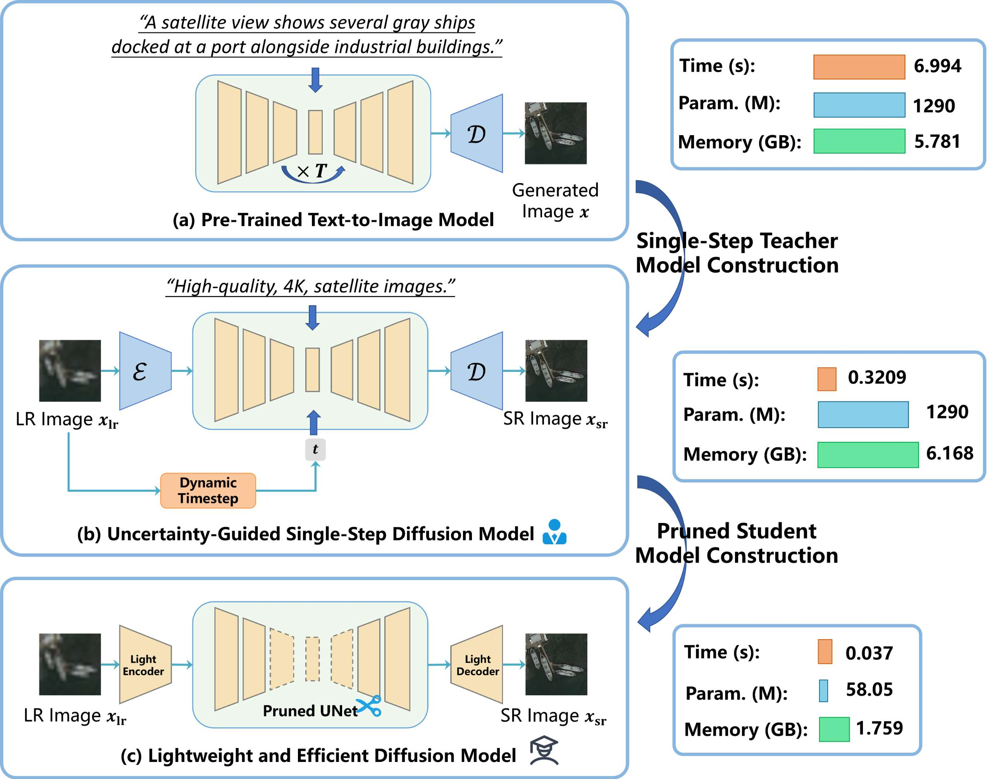
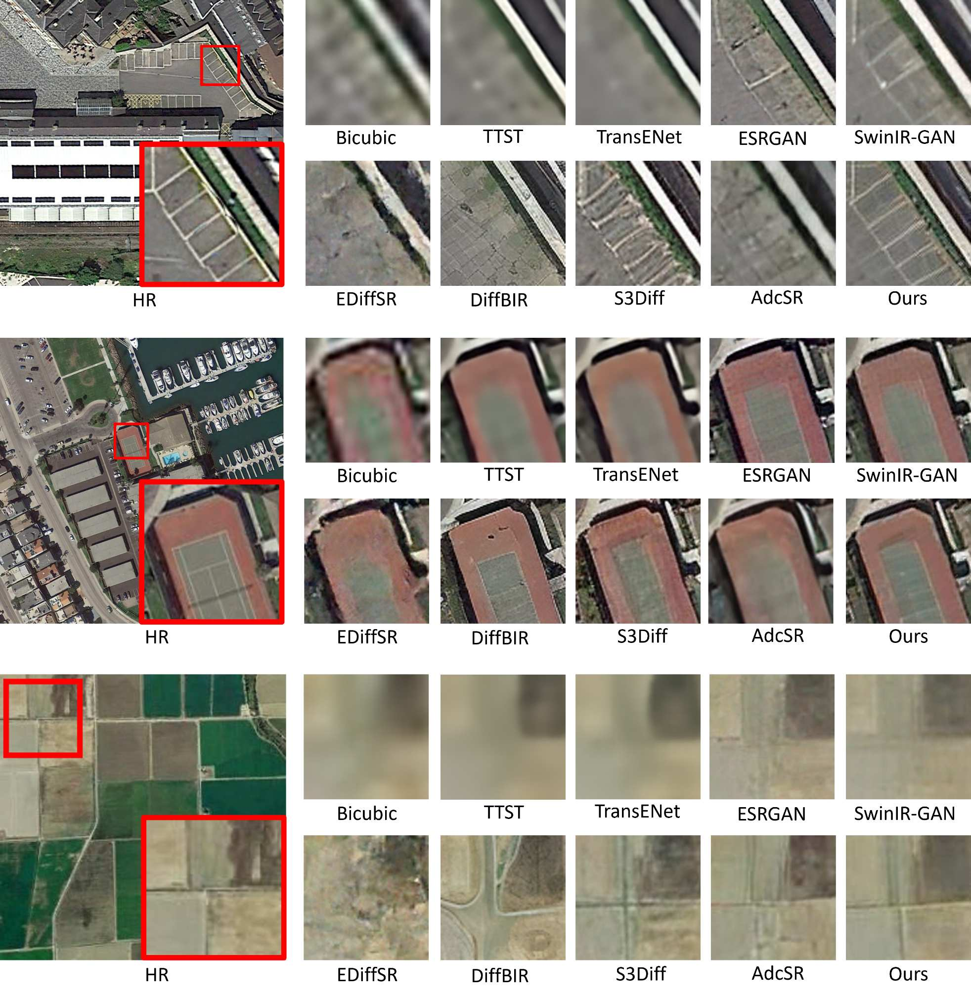
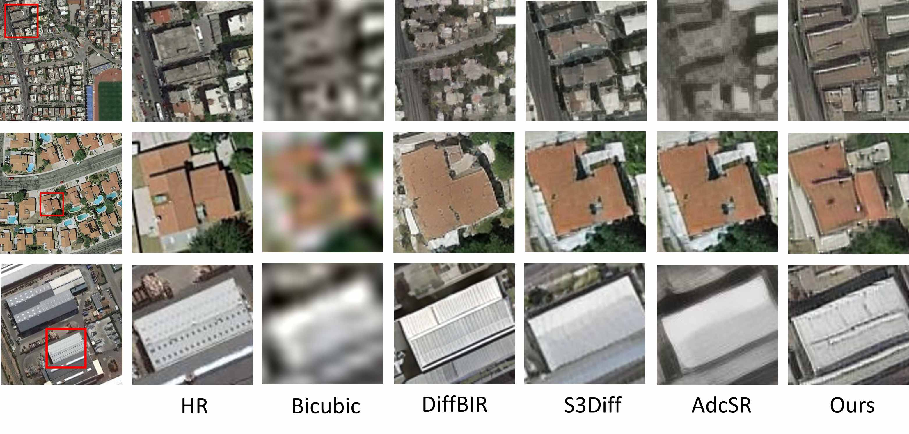
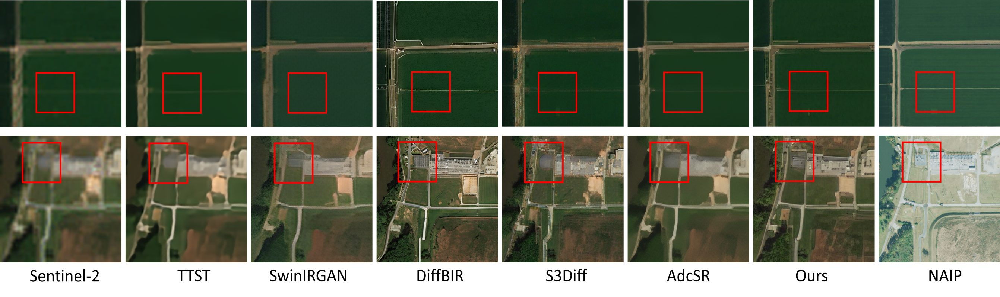

<h2 align="center">LED-SR: A Lightweight and Efficient Diffusion Model for Real-World Remote Sensing Image Super-Resolution</h2>

<div align="center">
	
Ce Wang<sup>1</sup>, Zhenyu Hu<sup>1</sup>, Wanjie Sun<sup>1,*</sup>

<sup>1</sup>School of Remote Sensing and Information Engineering, Wuhan University

</div>

<p align="center">
	
</p>

---

## Table of Contents

* [Visual Results](#visual_results)
* [Installation](#installation)
* [Pretrained Models](#pretrained_models)
* [Inference](#inference)
* [Release Note](#release_note)
* [Acknowledgements](#acknowledgements)
* [Contact](#contact)

---

## <a name="visual_results"></a>Visual Results

### Qualitative Comparison (x4 / x8)

<p align="center">
	
</p>

<p align="center">
	
</p>

<p align="center">
	
</p>

---

## <a name="installation"></a>Installation

```bash
# Clone this repository
git clone https://github.com/Guaishou74851/AdcSR.git
cd AdcSR

# Create environment
conda create -n LEDSR python=3.10 -y
conda activate LEDSR

# Install requirements
pip install --upgrade pip
pip install -r requirements.txt
```

---

## <a name="pretrained_models"></a>Pretrained Models

Download checkpoints from one of the links below and place them under weight/:

* Google Drive: https://drive.google.com/drive/folders/1uEz0q_5pnk3PMNCOtslb1M-M21F7DMQC?usp=sharing

Recommended files:

* x4 checkpoint: weight/net_params_4x.pkl
* x8 checkpoint: weight/net_params_8x.pkl

---

## <a name="inference"></a>Inference

1. Put all low-resolution images into one folder, e.g. testset/my_lr/.
2. Set LR_dir, SR_dir, and model_dir in the command below.

Run x4:

```bash
HF_ENDPOINT=https://hf-mirror.com CUDA_VISIBLE_DEVICES=0 \
python -u test_ours.py \
	--upscale=4 \
	--LR_dir=path/to/lr_img \
	--SR_dir=result/SR_4x \
	--model_dir=weight/net_params_4x.pkl
```

Run x8:

```bash
HF_ENDPOINT=https://hf-mirror.com CUDA_VISIBLE_DEVICES=0 \
python -u test_ours.py \
	--upscale=8 \
	--LR_dir=path/to/lr_img \
	--SR_dir=result/SR_8x \
	--model_dir=weight/net_params_8x.pkl
```

Super-resolved images will be saved to SR_dir.

---

## <a name="release_note"></a>Release Note

To align with the publication timeline, training scripts and full training recipes will be open-sourced after official paper acceptance.

---

## <a name="acknowledgements"></a>Acknowledgements

This project is built upon several excellent open-source works, including [S3Diff](https://github.com/ArcticHare105/S3Diff) and [AdcSR](https://github.com/Guaishou74851/AdcSR).

---

## <a name="contact"></a>Contact

If you have any questions, feel free to reach out to:
**Ce Wang** — [cewang@whu.edu.cn](mailto:cewang@whu.edu.cn)
